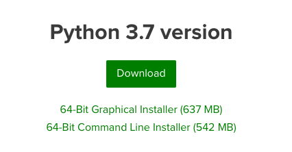

Next in-person Bootcamp: 3-7 June, San Francisco. [Register here](https://bootcamp.zerotodeeplearning.com)

------

[](https://travis-ci.org/zerotodeeplearning/intro_deep_learning_one_day)


# Intro to Deep Learning One Day Workshop

Hands-on Introduction to Deep Learning with Python and Tensorflow


## Quick start guide

### Download and Install Anaconda Python 3.7

The first step is to download and install Python 3 on your system, together with all the necessary libraries. Luckily for us Anaconda provides a convenient way to do so. Download and install it from here:

https://www.anaconda.com/distribution


Make sure to choose the **Python 3.7** version:




### Obtain the code for this tutorial
Next we are going to download the code for this tutorial, which is stored on Github. The following commands should be run from a terminal. Open a **Terminal** (Mac/Linux) or an **Anaconda prompt** (Windows). To obtain the code, clone this repository on your local computer. Type:
```
git clone https://github.com/zerotodeeplearning/intro_deep_learning_one_day.git
```
You can copy the full path from Github by clicking on the copy button:


> TIP: If you are not familiar with Git and Github you can just download the zip file of the repository.


#### Change to course folder
Once you have cloned or downloaded the code, make sure to change the current directory to the folder you've just downloaded, by typing:
```
cd intro_deep_learning_one_day
```

> TIP: If you downloaded the zip file and not the repo, you will need to unzip it and then your folder will be named `intro_deep_learning_one_day_master`. Just change directory using that one: `cd intro_deep_learning_one_day_master`


### Install Tensorflow
Anaconda already contains all the packages we need, except for Tensorflow. Which we need to install. In the terminal type:
```
conda install tensorflow==1.13.*
```
and agree to the package install and updates requests.

> TIP: If you prefer not to install Tensorflow in your base environment see instructions below for how to create a separate environment for this tutorial.


### Launch Jupyter Notebook

From the course folder, in the terminal, type:
```
jupyter notebook
```
If the command is not recognized try to close and open the terminal again, maybe the path needs to be updated after installation.

> TIP: You can also launch Jupyter using the Anaconda Launcher. This will open Jupyter at your default Home location and you will have to manually navigate to the course folder.

#### Open your browser to

If it didn't open automatically, you can find Jupyter at the following url:
```
http://localhost:8888
```

You are good to go! Enjoy!


### Optional: create a dedicated environment or the tutorial
The following is not necessary for the tutorial. If you want to create a virtual environment specifically for this tutorial, we provide an [environment configuration file](environment.yml).
#### Create the course environment
```
conda env create
```
wait for the environment to create, this may take a few minutes

#### Activate the environment (Mac/Linux)
```
conda activate ztdloneday
```

#### Activate the environment (Windows)
```
activate ztdloneday
```

Check that your prompt changed to

```
(ztdloneday) $
```

Now you can run jupyter notebook from within the environment.


### Troubleshooting

#### Updating Conda

If you have installed Anaconda a long time ago, you may want to update it by running

```
conda update conda
```

and then

```
conda update anaconda
```
